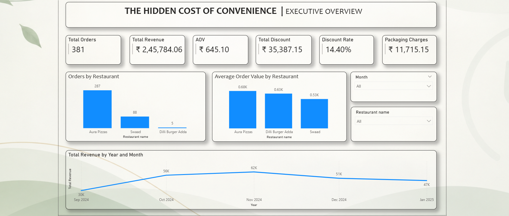
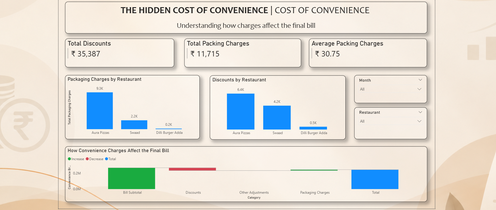
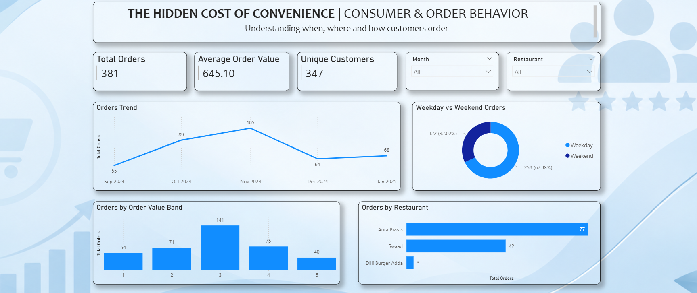
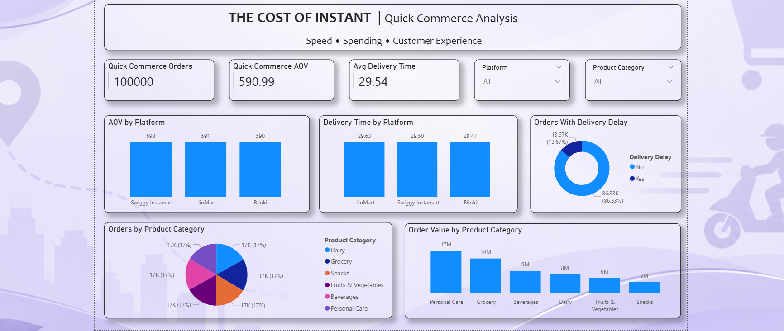

# Hidden Cost of Convenience

### Data Analytics & Power BI Project

An interactive data analytics project that explores the hidden costs associated with online food ordering and quick-commerce. The project analyzes orders, revenue, discounts, packaging charges, customer behavior, restaurant performance, and convenience-driven purchasing patterns.

---

## 📌 Project Overview

Convenience has changed the way customers order food and everyday products. While online platforms make ordering faster and easier, customers may also incur additional costs through discounts, packaging charges, and frequent convenience-driven purchases.

This project uses transactional data to analyze these patterns and identify how convenience affects customer spending and business performance.

The analysis was developed using **Power BI, Excel, and data analytics techniques** to transform raw transactional data into an interactive business dashboard.

---

## 🎯 Business Objectives

The project aims to answer the following questions:

- How are orders and revenue performing?
- What is the average order value?
- How much do customers receive in discounts?
- How significant are packaging charges?
- Which restaurants contribute most to overall performance?
- What patterns can be identified in customer ordering behavior?
- How does quick-commerce behavior contribute to convenience-driven spending?
- What additional costs are associated with online ordering?

---

## 🛠️ Tools & Technologies

- **Power BI** — Dashboard development, data modeling, DAX & visualization
- **Excel** — Data preparation and analysis
- **Data Analytics** — KPI analysis, trend analysis and business insights

---

# 📊 Dashboard

The project consists of four analytical dashboards.

## 1. Executive Overview

Provides a high-level view of overall business performance.

### Key KPIs

- Total Orders
- Total Revenue
- Average Order Value (AOV)
- Total Discounts
- Discount Rate
- Packaging Charges
- Restaurant Performance



---

## 2. Cost of Convenience

Focuses on the additional costs associated with online ordering and convenience.

### Analysis Includes

- Packaging charges
- Discounts
- Additional order costs
- Cost trends
- Convenience-related spending patterns





---

## 3. Customer & Order Behaviour

Analyzes customer ordering patterns and spending behavior.

### Analysis Includes

- Customer ordering patterns
- Order frequency
- Order value
- Spending behavior
- Order timing
- Customer segments



---

## 4. Quick Commerce

Examines quick-commerce ordering behavior and its contribution to convenience-driven spending.

### Analysis Includes

- Quick-commerce orders
- Revenue contribution
- Customer behavior
- Order frequency
- Convenience-driven purchasing patterns


---

# 🔍 Key Analytical Areas

| Analysis Area | Focus |
|---|---|
| Business Performance | Orders, revenue, AOV & restaurant performance |
| Cost of Convenience | Discounts, packaging & additional costs |
| Customer Behaviour | Ordering patterns & spending |
| Quick Commerce | Convenience-driven orders & revenue |

---

# ⚙️ Project Workflow

The project followed a structured data analytics workflow:

**Raw Data → Data Cleaning → Data Preparation → Data Analysis → KPI Development → Dashboard Design → Business Insights**

### Data Preparation

- Cleaned and organized transactional data
- Handled data inconsistencies
- Prepared fields for analysis
- Structured data for dashboard development

### Analysis

- Developed key performance indicators
- Analyzed revenue and order trends
- Examined discounts and packaging charges
- Studied customer and order behavior
- Analyzed quick-commerce patterns

### Visualization

Created an interactive Power BI dashboard with four analytical views:

1. Executive Overview
2. Cost of Convenience
3. Customer & Order Behaviour
4. Quick Commerce

---

# 💡 Business Value

The analysis provides a consolidated view of how convenience-driven ordering affects customers and businesses.

It helps identify:

- Revenue and order performance
- Customer spending patterns
- Discount dependency
- Additional charges
- Restaurant performance
- Quick-commerce behavior

These insights can support better understanding of customer behavior, pricing strategies, discount decisions, and overall business performance.

---

# 📁 Repository Contents

```text
├── README.md
│
├── Screenshots/
│   ├── executive_overview.png
│   ├── cost_of_convenience.png
│   ├── customer_order_behaviour.png
│   └── quick_commerce.png
│
├── Data/
│   └── Dataset.xlsx
│
└── Documentation/
    └── Hidden_Cost_of_Convenience_Project.pdf
